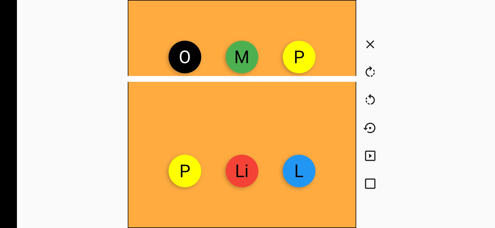
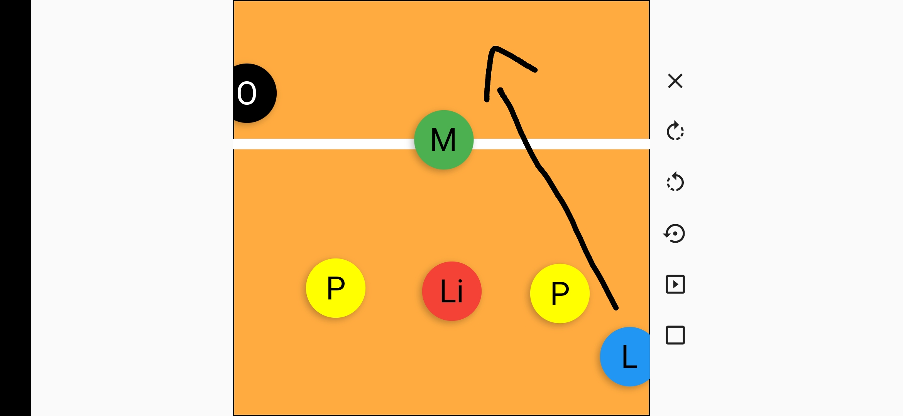
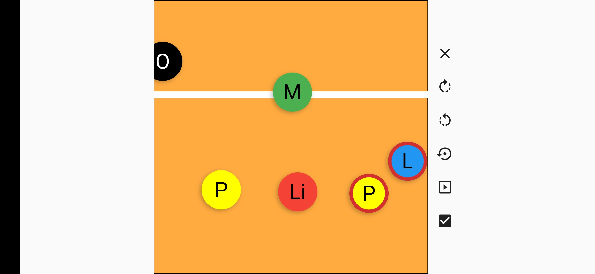

# Volleyball Rotations

[README em português](README.pt-br.md)

A cool app I made to help me and my friends learn the 5-1 rotation system for volleyball. Check out the screenshot:

You can drag the players around to place them and also draw on the court:

The letters stand for the player positions in portuguese (because that's the language we speak):

- L - Levantador (Setter)
- Li - Líbero (Libero)
- P - Ponteiro (Outside hitter)
- M - Meio (Middle blocker)
- O - Oposto (Opposite hitter)

## Button functionality

- The X clears the drawings
- The clockwise arrow rotates the players positions clockwise
- The counterclockwise arrow rotates the players positions counterclockwise
- The arrow with a dot on it resets the positions to the default positions
- The play button puts the players in the correct places for 5-1 serve receive (at least the 5-1 that we use)

The last one, the checkmark, is one of the best features for learning 5-1. It activates and deactivates the automatic checking of positional faults. When it's on and two players are out of place, they are highlighted red:

The project is made using Flutter and Dart. That means it works both on Android and IOS devices.
