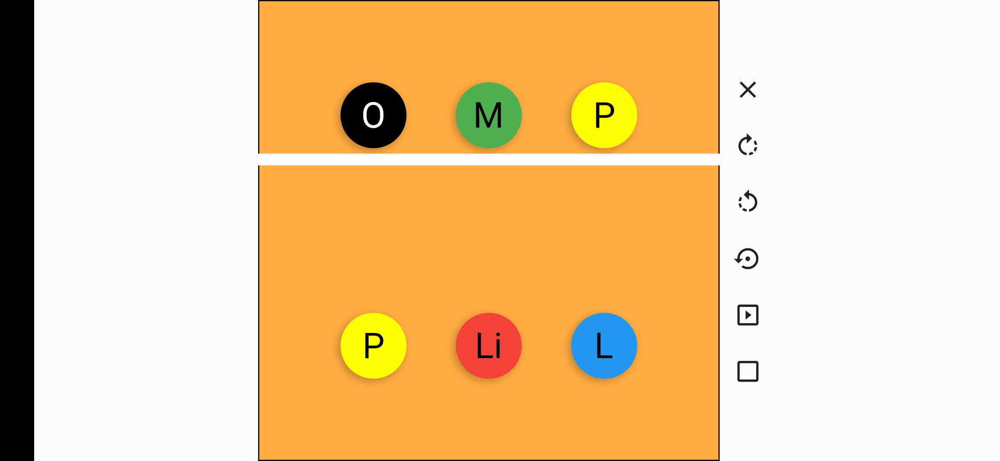
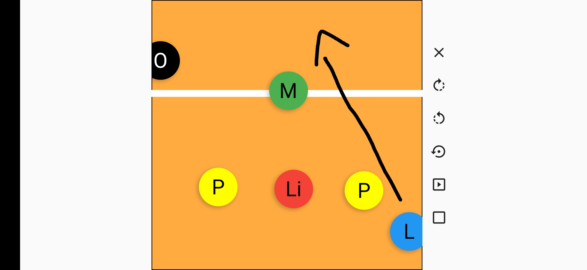
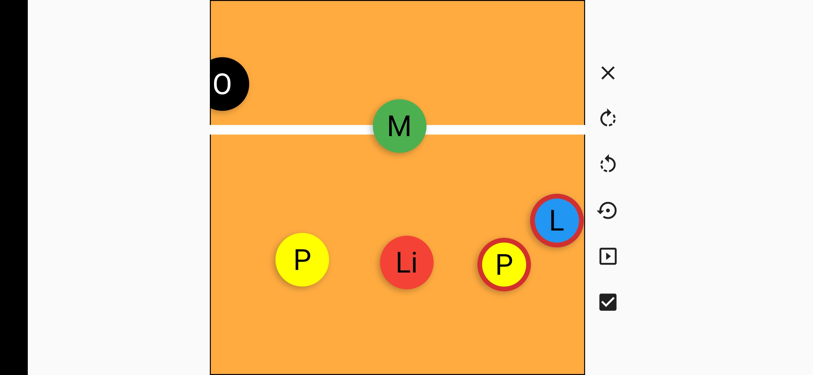

# Rodízios do voleibol

Um aplicativo legal que eu fiz para ajudar meus amigos a aprender o sistema de rodízio 5-1. Confere a print:

Você pode arrastar os jogadores para posicioná-los e pode desenhar na quadra:

As letras são as iniciais dos nomes das posições dos jogadores:

- L - Levantador
- Li - Líbero
- P - Ponteiro
- M - Meio
- O - Oposto

## Funções dos botões

- O X apaga os desenhos
- A seta no sentido horário roda a posição dos jogadores no sentido horário
- A seta no sentido anti-horário roda a posição dos jogadores no sentido anti-horário
- A seta com um ponto posiciona os jogadores no lugar padrão
- O botão de play coloca os jogadores nas posições de receber o saque no 5-1 (Pelo menos o 5-1 que nós usamos)

O último botão, o com uma marca de seleção, é uma das melhores funções para aprender o 5-1. Ele ativa e desativa a verificação de erros de rodízio. Quando ativado e dois jogadores estiverem fora de lugar, eles são realçados com uma borda vermelha:

O projeto foi feito usando Flutter e Dart. Isso significa que ele functiona em dispositivos Android e IOS
